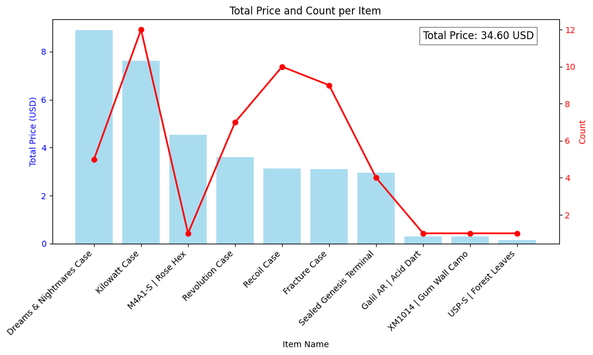
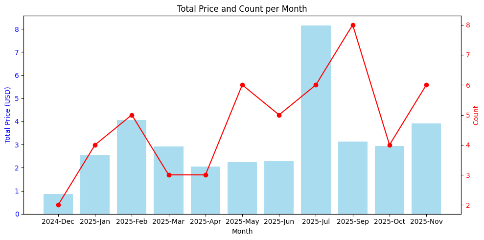

# CS2 Weekly Drop Statistics 📊

> Годовая статистика еженедельного дропа CS2 (Counter-Strike 2).  
> Эксперимент показывает, сколько предметов можно получить, собирая дроп каждую неделю в течение года.

---

## 🔹 Описание

В течение года собирался еженедельный дроп. Иногда пропускались 1–2 недели в начале года, но это не сильно влияет на общую статистику, так как данных достаточно.  

**Что такое дроп в CS2:**  
Каждую неделю даётся бонус за игру. В дропе четыре предмета, два из которых можно выбрать:

- **Кейс** — 100% шанс дропа.  
- **Скин** — чаще всего низкого качества; редкие предметы могут быть дорогими.  
- **Граффити** — 100% шанс дропа.  
- **Опции** — например, «разлом» брелков, ещё одно граффити или скин.  

Редко может выпадать предмет из **неактивного пула**, стоимостью $20–$100.

### Активный и неактивный пул

- **Активный пул** — предметы с шансом ~16–20%. Примеры кейсов:  
  `Sealed Genesis Terminal`, `Recoil Case`, `Revolution Case`, `Kilowatt Case`, `Dreams & Nightmares Case`, `Fracture Case`.
- **Неактивный пул** — очень редкие предметы (шанс ~0.1–0.2%).  

**Обновление активного пула** зависит от выпуска новых коллекций.  
**Количество кейсов в активном пуле:** обычно 6.

---

# Анализ

Данные о продаже предметов сохранены в JSON.  
Интересовали два вопроса:  

1. Сколько всего USD можно заработать за год?  
2. Можно ли окупить аккаунт, играя целый год?  

Простой скрипт для подсчёта:

```python
def get_total_price_by_name(items: List[MarketItem]) -> Dict[str, Tuple[float, int]]:
    totals = {}

    for item in items:
        if item.name in totals:
            total_price, count = totals[item.name]
            totals[item.name] = (total_price + item.price, count + 1)
        else:
            totals[item.name] = (item.price, 1)
        
    sorted_totals = dict(
        sorted(totals.items(), key=lambda x: x[1][0], reverse=True)
    )
    
    return sorted_totals

def print_total_price(total_price: float, total_price_by_name: Dict[str, float]) -> None:
    print(f"{'-'*45}")
    print(f"{'TOTAL PRICE':<15} | {total_price:>8.2f} {Currency.USD}")
    print(f"{'-'*45}\n")
    
    print(f"{'ITEM NAME':<15} | {'PRICE':>10}")
    print(f"{'-'*45}")
    for name, (price, count) in total_price_by_name.items():
        print(f"{name:<25} | {price:>10.2f} {Currency.USD} | {count} кол-во")
    print(f"{'-'*45}")

```
## Результат

```bash
------------------- TOTAL -------------------
---------------------------------------------
TOTAL PRICE     |    34.60 USD
---------------------------------------------

ITEM NAME       |      PRICE
---------------------------------------------
Dreams & Nightmares Case  |       8.90 USD | 5 кол-во
Kilowatt Case             |       7.62 USD | 12 кол-во
M4A1-S | Rose Hex         |       4.53 USD | 1 кол-во
Revolution Case           |       3.61 USD | 7 кол-во
Recoil Case               |       3.14 USD | 10 кол-во
Fracture Case             |       3.10 USD | 9 кол-во
Sealed Genesis Terminal   |       2.96 USD | 4 кол-во
Galil AR | Acid Dart      |       0.30 USD | 1 кол-во
XM1014 | Gum Wall Camo    |       0.29 USD | 1 кол-во
USP-S | Forest Leaves     |       0.15 USD | 1 кол-во
---------------------------------------------

```
## График



Аналогично анализ по месяцам:

```python
def get_total_price_by_month(items: List[MarketItem]) -> Dict[str, Tuple[float, int]]:
    totals = defaultdict(lambda: (0.0, 0))

    for item in items:
        current = item.listed_on.replace(day=1)
        end = item.acted_on.replace(day=1)
        while current <= end:
            month_str = current.strftime("%Y-%b")
            total_price, count = totals[month_str]
            totals[month_str] = (total_price + item.price, count + 1)
            
            if current.month == 12:
                current = current.replace(year=current.year + 1, month=1)
            else:
                current = current.replace(month=current.month + 1)
    
    totals_sorted = dict(
        sorted(
            totals.items(), 
            key=lambda x: datetime.strptime(x[0], "%Y-%b")
        )
    )
    return totals_sorted

def print_month_sales(total_price_by_month: Dict[str, Tuple[float, int]]) -> None:
    print(f"{'MONTH':<10} | {'PRICE':>14} | {'COUNT':>5}")
    print(f"{'-'*45}")
    
    for month, (price, count) in total_price_by_month.items():
        print(f"{month:<10} | {price:>10.2f} {Currency.USD} | {count:>5} кол-во")
    
    print(f"{'-'*45}")
```

## Результат

```bash
---------------------------------------------
MONTH      |          PRICE | COUNT
---------------------------------------------
2024-Dec   |       0.87 USD |     2 кол-во
2025-Jan   |       2.55 USD |     4 кол-во
2025-Feb   |       4.07 USD |     5 кол-во
2025-Mar   |       2.91 USD |     3 кол-во
2025-Apr   |       2.04 USD |     3 кол-во
2025-May   |       2.24 USD |     6 кол-во
2025-Jun   |       2.28 USD |     5 кол-во
2025-Jul   |       8.16 USD |     6 кол-во
2025-Sep   |       3.12 USD |     8 кол-во
2025-Oct   |       2.94 USD |     4 кол-во
2025-Nov   |       3.92 USD |     6 кол-во

```


## График



### Вывод
- Получено ~35 USD за год.  
- Окупить аккаунт можно, играя около полугода.  
- Финальный результат зависит от:  
  - Пропуска недели.  
  - Шанса дропа дорогого предмета (редкий, но прибыльный).  
  - Удачи.  

Фактический доход может достигать ~40 USD.